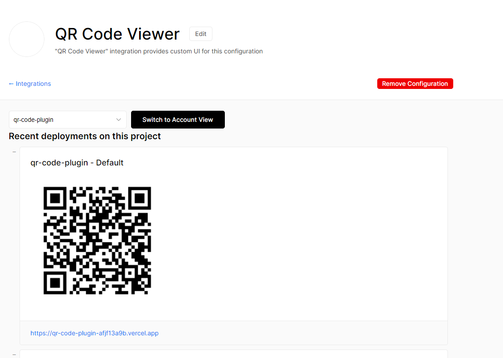

# Vercel Integration: QR Code Viewer

This UiHook displays QR Codes for recent deployment urls.

## Usage

Add it to your integrations through [the marketplace link](https://vercel.com/integrations/qr-code-viewer).



## Development

### Install

Install NPM dependencies with:

```
npm install
```

Then run this UiHook locally with:

```
vercel dev -p 5005
```

Then [create a Vercel integration](https://vercel.app/docs/integrations) and set the UiHook URI to: `http:///localhost:5005`

### Deploy to Production

Deploy this UiHook to production with:

```
vercel --prod
```

Then use the alias of your deployment as the new UiHook URI of your addon.
